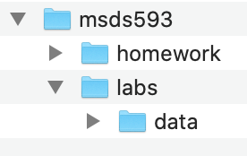

# MSDS593 Exploratory data analysis (EDA) and Visualization at the University of San Francisco

This course introduces students to the key...

## Administrivia

**INSTRUCTORS.** [Yannet Interian](https://www.usfca.edu/faculty/yannet-interian) and [Terence Parr](http://parrt.cs.usfca.edu). We are professors in the [MS in data science program](https://www.usfca.edu/arts-sciences/graduate-programs/data-science); Terence was also the founding director of MSDS at USF.  Please call us Yannet and Terence or Professor.

**OFFICE HOURS**

* Yannet 4-5pm on Tuesdays.
* Terence is generally available on slack or email on-demand

**SPATIAL COORDINATES:**<br>

* All classes are remote but live online, courtesy of COVID-19.

**TEMPORAL COORDINATES.** Wed 25 August to Fri 2 October

Please note: California time is GMT-7 and all lectures will be over zoom and recorded. Recorded lectures will appear on Canvas.

Week one:

* Lectures are live but recorded for international students:
  * US timezone: Wed&Fri 2-4PM California time

* Live sessions for international students
  * Euro time zone: Thur 9-10AM California time
  * Asia time zone: Wed&Fri 7-8PM  California time

Following weeks:

* Lectures are live but recorded for international students:
  * US timezone: Tue&Thur 2-4PM California time

* Live sessions for international students
  * Euro time zone: Wed&Fri 9-10AM California time
  * Asia time zone: Tue&Thur 7-8PM  California time

**INSTRUCTION FORMAT**. Live class runs for 2 hours, 2 days/week. Instructor-student interaction during lecture is encouraged by speaking up in zoom. We'll often mix in mini-exercises / labs during class. All programming will be done in the Python 3 programming language, unless otherwise specified.

We will be interleaving lectures from Yannet on Tuesdays and Terence on Thursdays for the main lectures. Yannet will be in Tuesday evening and Wednesday morning sessions for internationals and Terence will be in Thursday evening and Friday morning sessions.

**COURSE BOOKS** 

We will be using the following books available for free via the USF online library:

* [Storytelling with Data: A Data Visualization Guide for Business Professionals](https://learning.oreilly.com/library/view/storytelling-with-data/9781119002253/)
* [Storytelling with Data: Let’s Practice](https://learning.oreilly.com/library/view/storytelling-with-data/9781119621492/)
* [Python for Data Analysis: Data Wrangling with Pandas, NumPy, and IPython ](https://learning.oreilly.com/library/view/python-for-data/9781491957653/). 

To get access, [start at USF](https://guides.usfca.edu/oreilly) and then you can jump to the various books.

**PROFESSIONALISM**

The following items are even more important because all of us will be remote this Fall:
 
* Showing respect for your classmates and your professor
* Getting to class on time every time
* No cellphones, email, social media, slack, texting during the class
* Turn off all of your various notifications so you are not distracted
* Turn on your webcam on zoom

## Student evaluation

| Artifact | Grade Weight | Due date |
|--------|--------|--------|
|professionalism/attendance/labs| 20% | |
|3 Homeworks| 20% | | (previously 4 homeworks)
|Quiz 1| 10%| 9/03 |
|Quiz 2| 10%| 9/10 |
|Quiz 3| 10%| 9/24 |
|Quiz 4| 10%| 10/01 | (one week from previous)
|[Group Project](group-project.md)| 20%| 09/29|

Each project has a hard deadline and only those projects working correctly before the deadline get credit.

*I reserve the right to change projects until the day they are assigned.*

**Grading standards**. I consider an **A** grade to be above and beyond what most students have achieved. A **B** grade is an average grade for a student or what you could call "competence" in a business setting. A **C** grade means that you either did not or could not put forth the effort to achieve competence. Below **C** implies you did very little work or had great difficulty with the class compared to other students.

## Getting started

### Python environment

You should start out by watching video [A broad overview of python and tools used in our MSDS program](https://www.youtube.com/watch?v=d73hq8jCJ3s) on making sure you have the proper Python environment.  Make sure you have [Anaconda](https://www.anaconda.com/products/individual) installed and a very recent version. From the `Terminal` app, you should see the following (with `parrt` replaced with your user ID or name):

```
$ which python
/Users/parrt/opt/anaconda3/bin/python
$ python
Python 3.8.3 (default, Jul  2 2020, 11:26:31) 
[Clang 10.0.0 ] :: Anaconda, Inc. on darwin
Type "help", "copyright", "credits" or "license" for more information.
>>> 
```

You are to type `which python` and `python` at the `$` prompt to get those results. It indicates which version of Python you're using, which should be Anaconda-based:

```
/Users/parrt/opt/anaconda3/bin/python
```

and version 3.8 or above. Note that `/` is the path separator character and so, for example, `/Users/parrt/opt` means the `Users` directory under the root of the disk, `parrt` under that directory, and finally `opt` directory under that.

### Directory structure

We strongly recommend that you create an appropriate directory (folder) structure to organize the artifacts you create for classes and the resources you need.  When dealing with programs and data, the names and structure of your directories become part of the program and must be precise. Please remember that upper and lowercase letters are meaningfully different to the operating system and Python.

Creating an appropriate structure can be done manually using the OS X Finder, but it's better if you get used to using the terminal. Launching the terminal and executing the following commands creates a reasonable data structure but you can change it to suit your needs.

```
cd ~                # Jump to your home directory 
mkdir classes       # Make a subdirectory (folder)
cd classes          # Jump into the classes directory
mkdir msds593
cd msds593
mkdir homework
mkdir labs          # Start jupyter in this dir; put notebooks here
cd labs
mkdir data          # Here is where you download data used by notebooks
```

In the Finder afterwards, the structure look something like this:
 


You will be doing exercises during class in Terence's lectures and you should create a new notebook for each lecture because you must submit a PDF printout of the exercises associated with each lecture.

## Syllabus

We will be interleaving lectures from Yannet and Terence, but we can separate the topics into visualization, [pandas](https://pandas.pydata.org/) for data manipulation, and [matplotlib](https://matplotlib.org/) for basic plotting.

### Visualization (Yannet)

* value of visualization; the importance of context
* introduction to visualization design; choosing an effective visual
* visual perception and principles of design; clutter is your enemy!
* multivariate and time series data visualization; 
* visualizing trees, maps, networks and text
* storytelling with data

### Viz Implementation and EDA (Terence)

* [Coding and implementation overview](https://colab.research.google.com/github/parrt/msds593/blob/master/notebooks/eda-viz-impl-overview.ipynb)
* [Crash course in Python used in EDA](https://colab.research.google.com/github/parrt/msds593/blob/master/notebooks/python-crashcourse.ipynb)

#### Making plots with matplotlib

* [Basic matplotlib cookbook](https://colab.research.google.com/github/parrt/msds593/blob/master/notebooks/matplotlib-cookbook.ipynb)
* [Beautifying matplotlib plots](https://colab.research.google.com/github/parrt/msds593/blob/master/notebooks/matplotlib-beautify.ipynb)
* [Custom matplotlib plots](https://colab.research.google.com/github/parrt/msds593/blob/master/notebooks/matplotlib-customize.ipynb)

Topics:

* plots: bar chart, histogram, scatter, line, box, strip, violin,  bubble plot
* images (MNIST)
* displaying matrices / heatmaps
* overlaid plots for comparing variables; arrays of plots; shared axes
* drawing lines, shapes, text, annotations
* altering axes, labels; titles
* misc: legends, colorbar, linewidth, line style, colors, alpha channel

#### Pandas

* [Introduction to pandas](https://colab.research.google.com/github/parrt/msds593/blob/master/notebooks/pandas-intro.ipynb)
* [EDA for Kaggle NYC Rent data set](https://colab.research.google.com/github/parrt/msds593/blob/master/notebooks/nyrent.ipynb)
* [Even more NYC rent exploration](https://colab.research.google.com/github/parrt/msds593/blob/master/notebooks/nyrent2.ipynb)
* [Bulldozer auction exploration](https://colab.research.google.com/github/parrt/msds593/blob/master/notebooks/bulldozer.ipynb)

Topics:

* fundamentals: key data types. df vs series. numpy relationship.  dealing with NaN for missing elements vs empty string. categorical versus numerical.
* selecting, slicing, method chaining, indexes
* sorting, removing duplicates, shuffle, sample
* dates, strings
* pattern matching during selection
* aggregation, grouping, binning, quantiles
* map function or dictionary to Series (apply?)
* merging/joining/stacking

## Administrative details

**ACADEMIC HONESTY**. You must abide by the copyright laws of the United States and academic honesty policies of USF. You may not copy code from other current or previous students. All suspicious activity will be investigated and, if warranted, passed to the Dean of Sciences for action.  Copying answers or code from other students or sources during a quiz, exam, or for a project is a violation of the university’s honor code and will be treated as such. Plagiarism consists of copying material from any source and passing off that material as your own original work. Plagiarism is plagiarism: it does not matter if the source being copied is on the Internet, from a book or textbook, or from quizzes or problem sets written up by other students. Giving code or showing code to another student is also considered a violation.

The golden rule: **You must never represent another person’s work as your own.**

If you ever have questions about what constitutes plagiarism, cheating, or academic dishonesty in my course, please feel free to ask me.

*All persons with common code are likely to be considered at fault.*

### USF policies and legal declarations

*Students with Disabilities*

If you are a student with a disability or disabling condition, or if you think you may have a disability, please contact [USF Student Disability Services](https://myusf.usfca.edu/sds) (SDS) for information about accommodations.

*Behavioral Expectations*

All students are expected to behave in accordance with the [Student Conduct Code](https://myusf.usfca.edu/fogcutter/student-conduct) and other University policies.

*Academic Integrity*

USF upholds the standards of honesty and integrity from all members of the academic community. All students are expected to know and adhere to the University's [Honor Code](https://myusf.usfca.edu/academic-integrity/honor-code)

*Counseling and Psychological Services (CAPS)*

CAPS provides confidential, free [counseling](https://myusf.usfca.edu/caps) to student members of our community.

*Confidentiality, Mandatory Reporting, and Sexual Assault*

For information and resources regarding sexual misconduct or assault visit the <a href="https://myusf.usfca.edu/title-ix">Title IX</a> coordinator or USFs <a href="http://usfca.callistocampus.org">Callisto website</a>.
